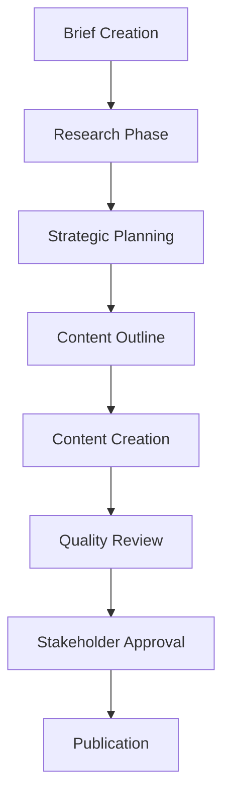

# Content Briefs Directory

This directory contains initial briefs for all content creation projects. Following the AI Operations Handbook process, **every piece of content must start with a brief** before moving to research and creation phases.

## Purpose

Content briefs serve as the foundation for our multi-step AI operations process by:

- **Defining clear objectives** and success metrics
- **Identifying target audiences** and key messages  
- **Setting research requirements** and quality standards
- **Establishing timeline and ownership** for accountability
- **Creating approval workflows** and review checkpoints

## Brief Structure

Each brief should include:

### 1. **Project Information**
- Creation date and content type
- Status and phase tracking
- Owner and reviewer assignments
- Estimated timeline

### 2. **Strategic Foundation**
- Clear objective and desired outcomes
- Target audience definition
- Key messages and positioning
- Success metrics and KPIs

### 3. **Research Requirements**
- Market analysis needs
- SEO and keyword research
- Authority source identification
- Competitive landscape review

### 4. **Content Strategy**
- Hook and opening approach
- Core argument and evidence structure
- Call-to-action hierarchy
- Distribution and promotion plan

### 5. **Quality Considerations**
- Brand voice and tone requirements
- Technical specifications
- Potential challenges and solutions
- Review and approval process

## Process Flow

## Naming Convention

Use descriptive filenames that include:
- **Project type**: `blog-post`, `email-campaign`, `whitepaper`, etc.
- **Topic/focus**: Brief description of subject matter
- **Date**: Creation month/year for tracking

**Examples**:
- `blog-post-ai-operations-intro-jan2024.md`
- `email-campaign-product-launch-feb2024.md`
- `whitepaper-industry-trends-mar2024.md`

## Status Tracking

Include status in brief header:
- **Brief Complete**: Ready for research phase
- **Research In Progress**: Market analysis and SEO research underway
- **Strategy Development**: Expanding brief with findings
- **Ready for Creation**: Approved brief with detailed strategy
- **In Review**: Content created, awaiting approval
- **Approved**: Ready for publication
- **Published**: Live content with performance tracking

## Quality Checklist

Before moving from brief to research phase, ensure:

- [ ] Clear, measurable objectives defined
- [ ] Target audience specifically identified
- [ ] Key messages articulated
- [ ] Success metrics established
- [ ] Research requirements detailed
- [ ] Timeline and ownership assigned
- [ ] Review process defined

## Examples

See `example-content-brief.md` for a comprehensive template showing all required elements and best practices.

## Integration with AI Operations

This briefs directory integrates with our Cursor Rules (`.cursor/rules/ai-ops-process.mdc`) to ensure:

- **Consistent Process**: AI assistant always starts with brief creation
- **Quality Gates**: Research and review requirements are enforced
- **Brand Alignment**: Context from company files is automatically considered
- **Approval Workflows**: Human oversight is built into every step

By maintaining this disciplined approach to content creation, we ensure every piece meets our quality standards and business objectives while making the most effective use of AI assistance. 